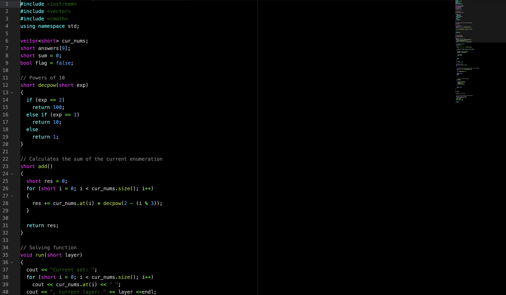
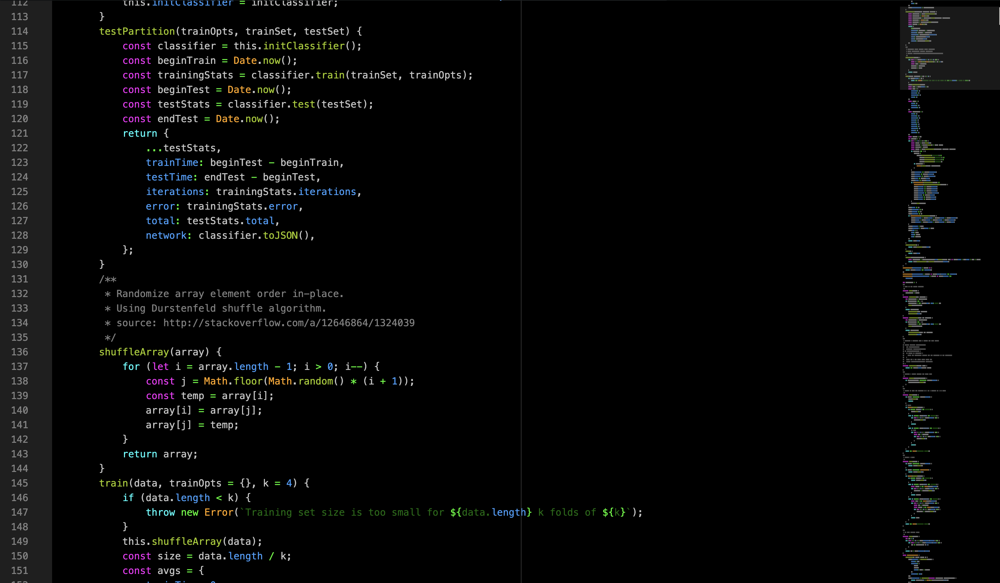
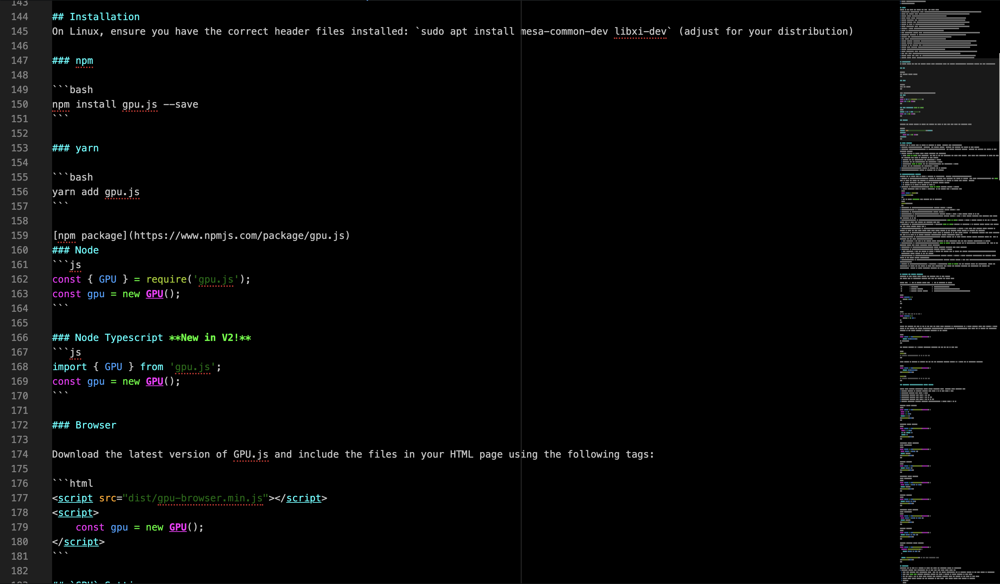
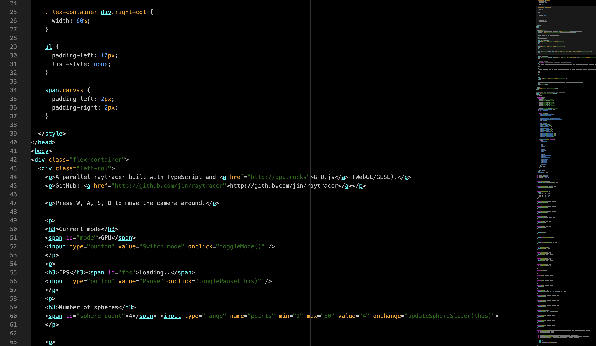

# spacey2-syntax
## A Github Atom Editor Syntax Theme

A syntax theme by Bryan351018, and preferred by himself.
Having a characteristic high-contrast design (_not necessarily for color-blindness compatibility_), this theme is designed to support as many languages as possible.

## Supported Languages

### Fully Supported
+ C++
+ JavaScript
+ HTML
+ CSS
+ MarkDown

### Partially Supported
+ LESS
+ Shell Script
+ Git Config
+ Perl
+ JSON

## Showcases

### C++

### JavaScript

_from [brain.js](https://github.com/BrainJS/brain.js)_

### MarkDown/JavaScript

_from [gpu.js](https://github.com/gpujs/gpu.js/)_

### CSS/HTML

_from [gpu.js](https://github.com/gpujs/gpu.js/)_

## License
The MIT License (see [LICENSE.md](LICENSE.md)).
